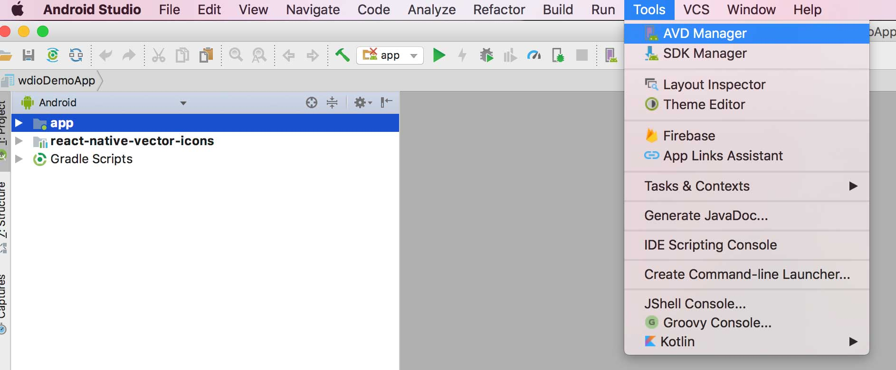

# Introduction 
This sample is designed for use in VsCode and includes source code for testing the web frontend using WebDriverIO Mocha with TypeScript for mobile testing. It also uses the Allure reporter to report results.

# Getting Started
TODO: Guide users through getting your code up and running on their own system. In this section you can talk about:
1. Install node
2. Install npm
3. Install VsCode

### Documentation
If you want to learn more refer the following:
- [WebdriverIO Official Docs](https://webdriver.io/docs/api/)

### Folder Structure

├───.vscode

│   └───launch.json

├───reports

│   ├───html

│   └───json

├───screenshots

├───tests

│   ├───specs

│   │   ├───login.spec.js

│   │   └───homepage.spec.js

│   ├───data

│   ├───helpers

│   ├───models

│   └───pageobjects

│       ├───page.ts
│   └───screenobjects

│       ├───components
            ├───TabBar.ts
│   ├───resources

├───config

│   ├───wdio.conf.ss

└───package.json

Here is the most basic folder structure of a WebDriverIO project:
 - .vscode: This folder contains the Visual Studio Code configuration file that specifies debugging settings
 - reports: This folder contains the HTML and JSON reports generated by the test runner.
 - screenshots: This folder contains screenshots captured during test execution.
 - tests: This folder contains all the test files, along with any associated data, helpers, and page objects.
 - specs: This folder contains the actual test files written in Mocha/Chai syntax.
 - data: This folder contains any test data in JSON format that is used in the test files.
 - helpers: This folder contains helper functions used in the test files.
 - pageobjects: This folder contains the Page Object Model (POM) files that define the web page elements and actions.
 - config: This folder contains the WebdriverIO configuration file (wdio.conf.js) and any environment variables required for test execution.
 - package.json: This file specifies the project's dependencies and metadata, including the test runner (mocha), assertion library (chai), and WebdriverIO packages (@wdio/cli, @wdio/local-runner, etc.)

# Installation 
1. Running `git clone https://github.com/webdriverio/appium-boilerplate.git`
1. Running `npm install`
1. Installing Appium on a local machine [here](./APPIUM.md)
1. Setting up Android and iOS on a local machine 
1. Making demo app available. Create a `./apps` directory. Download the app files (.app / .apk). Move the files into the directory `apps`.
1. Running tests `npm run android.app` or `npm run android.browser`

# Check version of WebdriverIO
To check your version of WebdriverIO you can perform the following:
_npx wdio --version_ 

# Migration
You can migrate to a new version of WebDriverIO when one becomes available. Consult Migration section in docs [here](https://webdriver.io/docs/gettingstarted)

# Updating Individual Packages
If you want to an individual package you need to perform the following:
_npm install <packagename>@latest_
Example:
_npm install chromedriver@latest_
_npm install @wdio/cli@latest_

# Updating All Packages
Install the package update checker using this documentation [here](https://www.npmjs.com/package/npm-check-updates)

Run the following command to determine the difference between all package versions in package.json versus the latest out there:
_npx ncu_

Then to update all packages that have been identified, you can run the following to update your package.json:
_npx npm-check-updates -u_ 

Then run _npm install_ to install new versions from your package.json.

# Setting up Android and iOS on a local machine

## Android
To use this boilerplate on a local machine for Android, emulator(s) need to be available.
To setup your local machine you should download Android Studio, see for instructions [here](https://developer.android.com/studio/).

Follow the instructions to download and setup Android studio and configure a your emulators with [this](https://developer.android.com/studio/run/managing-avds) tutorial.

Please use Google to find the correct instructions to setup your environment (Windows / Mac / Linux).

### Start the emulator
If you were able to create emulators you can use the following options to start the emulators

- From Android Studio itself through:
    - Open `Tools > AVD Manager`
    
    
    
    - Select your emulator and click on the `play`-button
    
    
    
- From the command line with the default Android commands, see [this](https://developer.android.com/studio/run/emulator-commandline) link
- Use a module called `start-android-emulator` which can be found [here](https://github.com/wswebcreation/start-android-emulator)

> It is advised to keep an emulator open and start tests against an already opened emulator to speed up tests. Starting an emulator manually/by Appium is time consuming and will slow down the test execution.

## iOS
Make sure you have a Mac, if you don't have a Mac then buy/get one, otherwise it will not work (no legal way to use iOS on Windows/Linux).

To be able to configure iOS simulators you need to download Xcode on your machine, check [this](https://developer.apple.com/xcode/) on how to install it.

### iOS versions
After installation you'll get the latest supported iOS version already installed. At the moment of writing this was `iOS 12.0`. If you want an older version of iOS please download them manually by doing the following:

1. Open Xcode (you don't need to start a project, having the project selector open is sufficient)
1. Go to Xcode preferences like below

    
    
1. A pop-up will appear like below

    
    
1. Go to `Components` and download the needed versions like below 

    
    
    
### Start a simulator
You can use the following options to manually start a simulator:

- Through the Simulator app, find it on Mac and add it to your dock like below

    

    

- Use a module called `start-ios-simulator` which can be found [here](https://github.com/wswebcreation/start-ios-simulator). With this module you can easily use your terminal to select your simulator

> It is advised to keep a simulator open and start tests against an already opened simulator to speed up tests. Starting a simulator manually/by Appium is time consuming and will slow down the test execution.

# Installing Appium on a local machine

> There are several documents and instructions on the internet to install Appium on your local machine.
This is just one of the many ;-)

To setup the local test environment the following needs to be installed:

- [appium-doctor](https://github.com/appium/appium-doctor) with `npm install appium-doctor -g`
- [Appium](https://github.com/appium/appium) with `npm install appium -g`
- [appium-desktop](https://github.com/appium/appium-desktop). This one needs to be downloaded from [here](https://github.com/appium/appium-desktop/releases) and pick the latest stable releases
- [appium-inspector](https://github.com/appium/appium-inspector). Used to be part of appium-desktop, now needs to be installed separately. Can be downloaded from [here](https://github.com/appium/appium-inspector/releases) and pick the latest stable release

## Setup a local machine

### Appium Doctor
appium-doctor is used to diagnose and fix common Node, iOS and Android configuration issues before starting Appium. You only run it once to check your local machine. See an example output below.

```bash
appium-doctor

info AppiumDoctor Appium Doctor v.1.4.3
info AppiumDoctor ### Diagnostic starting ###
info AppiumDoctor  ✔ The Node.js binary was found at: /Users/wswebcreation/.nvm/versions/node/v8.9.1/bin/node
info AppiumDoctor  ✔ Node version is 8.9.1
info AppiumDoctor  ✔ Xcode is installed at: /Applications/Xcode.app/Contents/Developer
info AppiumDoctor  ✔ Xcode Command Line Tools are installed.
info AppiumDoctor  ✔ DevToolsSecurity is enabled.
info AppiumDoctor  ✔ The Authorization DB is set up properly.
info AppiumDoctor  ✔ Carthage was found at: /usr/local/bin/carthage
info AppiumDoctor  ✔ HOME is set to: /Users/wswebcreation
info AppiumDoctor  ✔ ANDROID_HOME is set to: /Users/wswebcreation/Library/Android/sdk
info AppiumDoctor  ✔ JAVA_HOME is set to: /Library/Java/JavaVirtualMachines/jdk1.8.0_152.jdk/Contents/Home
info AppiumDoctor  ✔ adb exists at: /Users/wswebcreation/Library/Android/sdk/platform-tools/adb
info AppiumDoctor  ✔ android exists at: /Users/wswebcreation/Library/Android/sdk/tools/android
info AppiumDoctor  ✔ emulator exists at: /Users/wswebcreation/Library/Android/sdk/tools/emulator
info AppiumDoctor  ✔ Bin directory of $JAVA_HOME is set
info AppiumDoctor ### Diagnostic completed, no fix needed. ###
info AppiumDoctor
info AppiumDoctor Everything looks good, bye!
info AppiumDoctor
```

When appium-doctor can, it will fix the problems for you, otherwise fix them manually. If you have some ENV issues make sure you have set them like this

```bash
export ANDROID_HOME=/Users/wswebcreation/Library/Android/sdk
export JAVA_HOME=$(/usr/libexec/java_home)
export PATH=$PATH:$ANDROID_HOME/platform-tools:$ANDROID_HOME/tools:$ANDROID_HOME/platform-tools/adb:$ANDROID_HOME/build-tools:$JAVA_HOME/bin
# This one is used for the `start.android.emulator` script
export emulator=/Users/wswebcreation/Library/Android/sdk/emulator
```

### Appium
If the npm install was successful you should be able to run this command `appium -v` and see a version like below.

```bash
➜  appium -v
1.9.0
➜
```

> Always make sure to check the Appium site if there is a new version. New Appium version are released mostly when Android/iOS release new versions.
Bugfixes can also be released. Just check the [changelog](https://github.com/appium/appium/blob/master/CHANGELOG.md) for a clear overview

## Appium desktop
Appium Desktop is an open source app which gives us the ability of the Appium automation server in a UI. It is a combination of a few Appium-related tools:

- A graphical interface for the Appium Server. You can set options, start/stop the server, see logs, etc...
- An Inspector (installed separately) that you can use to look at your app's elements, get basic information about them, and perform basic interactions with them. This is useful as a way to learn about Appium or as a way to learn about your app so you can write tests for it.

This tool is mainly used to view the UI-hierarchy and locate elements to be sure that all elements can be found.

See the [readme](https://github.com/appium/appium-desktop) about how to use the Appium Desktop.

When Appium Destkop is started make sure the _Automatic Server_-tab is enabled. Use the following settings for Android (also check [here](../config/wdio.android.app.conf.ts))

```js
{
  "app": "/Users/wswebcreation/git/appium-boilerplate/apps/Android-NativeDemoApp-0.2.0.apk",
  "platformName": "Android",
  "deviceName": "Pixel XL",
  "platformVersion": "7.1.1",
  "noReset": true,
  "automationName": "UiAutomator2"
}
```

And the following settings for iOS (also check [here](../config/wdio.ios.app.conf.ts))


```js
{
  "platformName": "iOS",
  "appium:app": "/Users/wswebcreation/git/appium-boilerplate/apps/iOS-NativeDemoApp-0.2.0.zip",
  "appium:deviceName": "iPhone 6",
  "appium:platformVersion": "11.1",
  "appium:noReset": true
}
```
# Build and Test
1. From command line navigate to source project folder and perform 
TBD

## Run specific spec interactively

npm run ios.app -- --spec=tests/specs/app.login.spec.ts

## Run specific suite interactively
See documentation [here](https://webdriver.io/docs/organizingsuites/)
_npm run wdio --suite <suiteName>_

## Wait Strategies
 1. Waits - [here](https://webdriver.io/docs/autowait/)
 2. WaitForClickable - [here](https://webdriver.io/docs/api/element/waitForClickable/)
 3. WaitForDisplayed - [here](https://webdriver.io/docs/api/element/waitForDisplayed)
 4. WaitForEnabled - [here](https://webdriver.io/docs/api/element/waitForEnabled)
 5. WaitForExist - [here](https://webdriver.io/docs/api/element/waitForExist)
 6. WaitUntil - [here](https://webdriver.io/docs/api/element/waitUntil)

## Use UiAutomator Selectors
[Android UiAutomator](https://webdriver.io/docs/selectors/#android-uiautomator) & [Android UiAutomator Selector](https://developer.android.com/reference/androidx/test/uiautomator/UiSelector)
[UiAutomator Selector](https://appium.io/docs/en/writing-running-appium/android/uiautomator-uiselector/)

## Run tests using CLI using a different environment

TBD
Cross ENV is the package library that is being used to run test across multiple environments [here](https://www.npmjs.com/package/cross-env). By default the following environment configurations are included:
1. LOCAL
2. DEV
3. QA
4. STAGE

You can point to a specific baseUrl based on the configurations you pass above. For example, the following will run agains the QA environment specified in the wdio.conf.ts file:
_npx cross-env ENV=QA npm run test_

This is especially useful when interacting with Service APIs.

## Running Suites
You can run suites of tests. Consult documentation [here](https://webdriver.io/docs/organizingsuites/)

# Configurations
See documentation [here](https://webdriver.io/docs/watcher/#:~:text=With%20the%20WDIO%20testrunner%20you,it%20ran%20all%20tests%2C%20e.g.)

# Reports
The most popular types are:
1. [Spec](https://webdriver.io/docs/spec-reporter/)
2. [Allure](https://webdriver.io/docs/allure-reporter)
3. [Mochawesome](https://webdriver.io/docs/wdio-mochawesome-reporter)

## Generate Report
TBD
By default, this framework is set to use _spec_ and _allure_. To generate the allure report:

_npm run report_

# Additional References
 1. Official documentation [here](https://webdriver.io/docs)
 2. Chai Assertions - [here](https://webdriver.io/docs/assertion/)
 3. XPath plugin - [here](https://v6.webdriver.io/docs/selectors.html)
 4. WebDriverIO + Jenkins CI Integration - [here](https://webdriver.io/docs/jenkins/)
 5. WebDriverIO + Azure CI Integration - [here](https://webdriver.io/docs/gmangiapelo-wdio-azure-devops-service/)
 5. WebDriverIO + GitLab CI Integration - [here](https://docs.gitlab.com/ee/ci/examples/end_to_end_testing_webdriverio/) and [here](https://medium.com/dolap-tech/how-to-run-selenium-automation-tests-on-gitlab-ci-cd-github-actions-bd743142ad4c)

## Reporting bugs in WebDriverIO
Alternatively, you can report bugs that you encounter in WebDriverIO [here](https://github.com/webdriverio/webdriverio/issues)

# Appium Boilerplate

**NOTE:** This boilerplate is for Webdriver V7 where the tests are written with `async`/`await` and TypeScript. If you need a boilerplate for sync mode then check the following:

- V7 (TypeScript) please click [here](https://github.com/webdriverio/appium-boilerplate/tree/sync-mode)
- V6 (JavaScript) please click [here](https://github.com/webdriverio/appium-boilerplate/tree/v6)
- V5 (JavaScript) please click [here](https://github.com/webdriverio/appium-boilerplate/tree/v5)
- V4 (JavaScript) please click [here](https://github.com/webdriverio/appium-boilerplate/tree/v4)

Boilerplate project to run Appium tests together with WebdriverIO for:

- iOS/Android Native Apps
- iOS/Android Hybrid Apps
- Android Chrome and iOS Safari browser ([check here](./README.md#automating-chrome-or-safari))

> **Note:**
> This boilerplate only handles local execution on 1 em/simulator at a time, not parallel execution. For more info about that Google on setting up a grid with Appium.

## Configuration files

This boilerplate uses a specific config for iOS and Android, see [configs](./config). The configs are based on a shared config
[`wdio.shared.conf.ts`](./config/wdio.shared.conf.ts).
This shared config holds **all the defaults** so the iOS and Android configs only need to hold the capabilities and specs that are needed
for running on iOS and or Android (app or browser).

Please check the [`wdio.shared.conf.ts`](./config/wdio.shared.conf.ts)-file for the minimal configuration options. Notes are added for why
a different value has been selected in comparison to the default values WebdriverIO provides.

Since we do not have Appium installed as part of this package we are going to use the globally installed version of Appium. This is
configured in [`wdio.shared.local.appium.conf.ts`](./config/wdio.shared.local.appium.conf.ts).

## Locator strategy for native apps

The locator strategy for this boilerplate is to use `accessibilityID`'s, see also the
[WebdriverIO docs](https://webdriver.io/docs/selectors#accessibility-id) or this newsletter on
[AppiumPro](https://appiumpro.com/editions/20).
`accessibilityID`'s make it easy to script once and run on iOS and Android because most of the apps already have some `accessibilityID`'s.

If `accessibilityID`'s can't be used, and for example only XPATH is available, then the following setup could be used to make cross-platform
selectors

```js
const SELECTORS = {
    WEB_VIEW_SCREEN: browser.isAndroid
        ? '*//android.webkit.WebView'
        : '*//XCUIElementTypeWebView',
};
```

> **NOTE:** If you look into the screen/page-objects you might see that a lot of selectors are made private, meaning you can use the
> elements in the spec-file itself. This has been done on purpose because one of the *best practices* is to remove all interactions from
> your spec files and implement the interactions in the page objects. This will make it easier to maintain for the future and easier to
> refactor if new interaction methods will be added or names will be adjusted.

## Native App Tests

All tests can be executed on the devices as configured in [`wdio.android.app.conf.ts`](./config/wdio.android.app.conf.ts) or
[`wdio.ios.app.conf.ts`](./config/wdio.ios.app.conf.ts). Please check the below tests on what they do or on how to run them separately.

```sh
# For Android local execution
npm run android.app

# For iOS local execution
npm run ios.app
```

### Drag And Drop

Drag and Drop an element can be a complex gesture to automate with Appium. The demo app has a simple puzzle that hopefully makes it easier
and fun to understand how to implement a drag and drop in WebdriverIO. The test can be found [here](./tests/specs/app.drag.and.drop.spec.ts)
and the drag and drop implementation can be found in [this](./tests/screenobjects/DragScreen.ts)-file.
This file will now only hold the [`touchAction`](https://webdriver.io/docs/api/browser/touchAction/) way of using the drag and drop Gesture.
The `touchPerform` is the *old* JSONWP way of implementing a gesture and is not W3C compatible. The `touchAction` is the new official W3C
implementation of a gesture.

### Swiping

Swiping is basically a movement with your finger on the screen that has a starting position on the screen, an x-, and y-coordinate and an
end position, also an x-, and y-coordinate. The starting position can be seen as the first time you touch the screen, the initial *press*.
The end position can be seen as the time you release the screen. If you translate this to steps you will get:

1. Press your finger on the screen on starting position
1. Move your finger to the end position
1. Release your finger when you are on the end position

The [Swipe](./tests/specs/app.swipe.spec.ts)-test will be an example on how to do that. It uses a
[Gesture](./tests/helpers/Gestures.ts)-helper that might be useful for you in the future.

If you want to know more about Gestures and how to automate them, then we would advise you to watch
[this presentation "Swiping your way through Appium by Wim Selles"](https://youtu.be/oAJ7jwMNFVU).

You can run the single test with the following commands

```sh
# For Android local execution
npm run android.app -- --spec=tests/specs/app.swipe.spec.ts

# For iOS local execution
npm run ios.app -- --spec=tests/specs/app.swipe.spec.ts
```

### WebViews

The app has a WebView that will automatically load the WebdriverIO documentation page. This boilerplate holds 2 test files:

1. [Interact within a WebView with CSS Selectors](./tests/specs/app.webview.spec.ts).
   *You will also find a test that interacts between a WebView and the Native part of the app.*
1. [Automate a WebView based on Native Selectors](./tests/specs/app.webview.xpath.spec.ts). This test will compare the execution time of:

    - automating the WebView by **NOT** switching to the WebView (by using native selectors).
    - automating the WebView by **SWITCHING** to the WebView.

    Check the console for load time differences. An example time could look like this

    ```log
    // Android
    [0-0] RUNNING in Android - /tests/specs/app.webview.xpath.spec.ts
    [0-0] Test time for using XPATH It took 0.799 seconds.
    [0-0] Test time for switching to the WebView It took 0.238 seconds.
    [0-0] PASSED in Android - /tests/specs/app.webview.xpath.spec.ts

    // iOS
    [0-0] RUNNING in iOS - /tests/specs/app.webview.xpath.spec.ts
    [0-0] Test time for using XPATH It took 3.125 seconds.
    [0-0] Test time for switching to the WebView It took 1.443 seconds.
    [0-0] PASSED in iOS - /tests/specs/app.webview.xpath.spec.ts
    ```

You will also find a [WebView](./tests/helpers/WebView.ts)-helper with hopefully useful methods that can help you automate a Hybrid App.
Keep in the back of your mind that for *simplicity* of the Demo app only one WebView is used. This is also used in the WebView-helper.

More information about **Automating Hybrid Applications with Appium** and more complex WebViews can be found in
[this webinar](https://youtu.be/_mPCRxplBfo) recording.

You can run the single test with the following commands

```sh
# For Android local execution
npm run android.app -- --spec=tests/specs/app.webview.spec.ts
npm run android.app -- --spec=tests/specs/app.webview.xpath.spec.ts

# For iOS local execution
npm run ios.app -- --spec=tests/specs/app.webview.spec.ts
npm run ios.app -- --spec=tests/specs/app.webview.xpath.spec.ts
```

## Automating Chrome or Safari

Mobile web automation is almost the same as writing tests for desktop browsers. The only difference can be found in the configuration that
needs to be used. Click [here](config/wdio.ios.browser.conf.ts) to find the config for iOS Safari and
[here](config/wdio.android.browser.conf.ts) for Android Chrome.
For Android be sure that the latest version of Chrome is installed, see also
[here](./docs/FAQ.md#i-get-the-error-no-chromedriver-found-that-can-automate-chrome-). Our
[`wdio.shared.local.appium.conf.ts`](./config/wdio.shared.local.appium.conf.ts) uses the `relaxedSecurity: true` argument from Appium which
will allow Appium to automatically download the latest ChromeDriver.

For this boilerplate the testcases from the [jasmine-boilerplate](https://github.com/webdriverio/jasmine-boilerplate), created by
[Christian Bromann](https://github.com/christian-bromann), are used.

## Cloud vendors

### Sauce Labs

If you want to run the Native App tests on Sauce Labs you need to do 2 things:

- Add the [Sauce Service](#add-sauce-service) to your project
- Upload the apps to the [Sauce Labs Storage](#upload-apps-to-sauce-storage)

When the above has been executed you can follow the steps in:

- [Run app tests on the Sauce Labs Real Device Cloud](#run-app-tests-on-the-sauce-labs-real-device-cloud)
- [Run app tests on the Sauce Labs Emulators and Simulators](#run-app-tests-on-the-sauce-labs-emulators-and-simulators)

#### Add Sauce Service

Make sure you install the latest version of the `@wdio/sauce-service` with

```shell
npm install --save-dev @wdio/sauce-service
```

and add `services: ['sauce'],` to the config. If no `region` is provided it will automatically default to the US-Virtual/RDC cloud.
If you provide `region: 'us'` or `region: 'eu'` it will connect to the US or the EU Virtual/RDC cloud.

#### Upload apps to Sauce Storage

If you want to use Android emulators, iOS simulators or Android real devices in the Sauce Labs UI you need to upload the apps to the Sauce
Storage. You can find a script to upload them to, and the US, and EU DC in [this](./scripts)-folder. You can push the files to the storage
by executing the following steps in a terminal from the root of this project:

```sh
cd scripts
./push_apps_to_sauce_storage.sh
```

When you've done that you will see a lot of successful logs in your terminal.

#### Run app tests on the Sauce Labs Real Device Cloud

> **NOTE:** Due to signing iOS Real Devices are not supported. Only Android Real Devices are supported.

Please check the [Android Real Devices](./config/wdio.android.app.conf.ts)-config to see the setup for Android real devices.

You can use the following scripts, see the [`package.json`](./package.json), to execute the tests in the cloud:

```sh
# For Android Real Devices
# On EU DC
npm run android.sauce.rdc.app.eu
# On US DC
npm run android.sauce.rdc.app.us
```

#### Run app tests on the Sauce Labs Emulators and Simulators

Please check the following configs to verify the configurations:

- [Android Emulators](./config/saucelabs/wdio.android.emulators.app.conf.ts)
- [iOS Simulators](./config/saucelabs/wdio.ios.simulators.app.conf.ts)

The following scripts that can be used, see the [`package.json`](./package.json), to execute the tests in the cloud:

```sh
# For Android Emulators
# On EU DC
npm run android.sauce.emulators.app.eu
# On US DC
npm run android.sauce.emulators.app.us
# For Android Real Devices
# On EU DC
npm run android.sauce.rdc.app.eu
# On US DC
npm run android.sauce.rdc.app.us

# For iOS
# On EU DC
npm run ios.sauce.simulator.app.eu
# On US DC
npm run ios.sauce.simulator.app.us
```

### BrowserStack

This boilerplate provides a setup for testing with BrowserStack. Please check the [BrowserStack](./config/browserstack)-folder to see the
setup for iOS and Android.

Make sure you install the latest version of the `@wdio/browserstack-service` with

```shell
npm install --save-dev @wdio/browserstack-service
```

There are 2 scripts that can be used, see the [`package.json`](./package.json), to execute the tests in the cloud:

```sh
# For iOS
$ npm run ios.browserstack.app

# For Android
$ npm run android.browserstack.app
```

## FAQ

See [FAQ](./FAQ.md)

## Tips and Tricks

 **PRO TIP:** If you are automating iOS apps and you can use Deep Links, then you might want to try adding the capability
> `autoAcceptAlerts:true` when you start the iOS device. This capability will automatically accept all alerts, also the alert that will
> appear when you want to open your deep link in Safari.
>
> If you ware going to use this capability, then don't forget to remove the last few lines in the
> [`openDeepLinkUrl()`](./tests/helpers/Utils.ts)-method, see the comments in the method

You can run the single test with the following commands


See [Tips and Tricks](./TIPS_TRICKS.md)

# Contribute
If you would like to contribute to the source, please reach out to Director of Quality Engineering, Antwan Maddox,
or the Automation Team within the Quality Guild.
